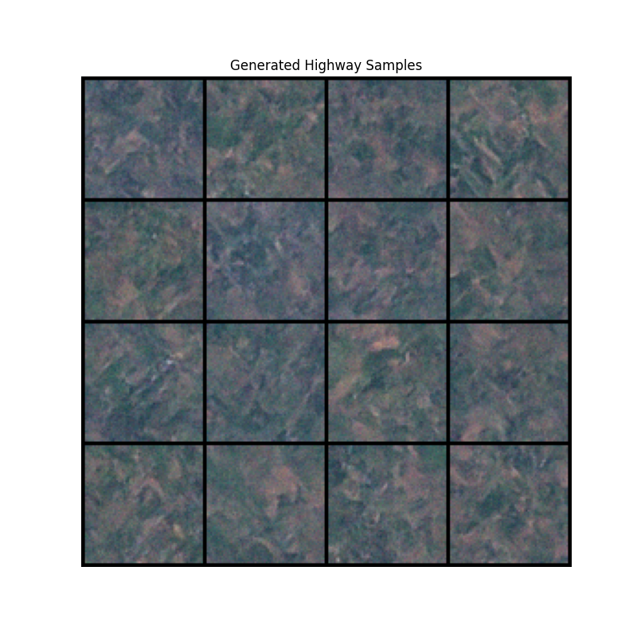

This model learns to create synthetic satellite photos by reversing a noise process. While it successfully captures the green, forest-like textures of the landscape, it misses the sharp, high-frequency details needed to render clear highways.

### Diffusion Mechanism

The diffusion mechanism works by gradually adding Gaussian noise to an image until it becomes pure random noise. The model is then trained to reverse this process, learning to "denoise" the data step-by-step. By predicting the score (the gradient of the log-density), it can navigate from a state of total chaos back to a structured image that looks like the training data.

### To-Do List

* **Run with significantly more epochs:** Increase training duration to ensure the model converges on the data distribution.
* **Try transformer-based model:** Replace the U-Net with a DiT (Diffusion Transformer) to better handle complex spatial relationships.
* **Add skip connections:** Ensure high-frequency details are preserved by linking encoder and decoder layers.

