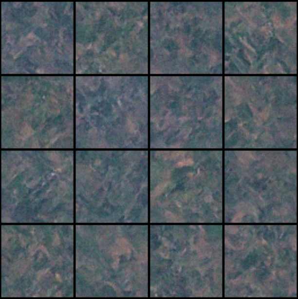
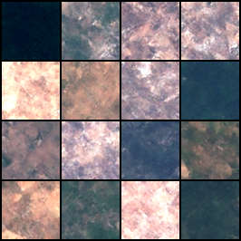

# Satellite Image Generation with Diffusion

This project explores using diffusion models to generate synthetic satellite photos from the EuroSAT dataset. The goal is to compare how different architectures handle the reconstruction of landscape features.

### Diffusion Mechanism

The process works by gradually adding Gaussian noise to an image until it becomes pure random noise. The model is trained to reverse this, learning to "denoise" the data step-by-step. By predicting the score (the gradient of the log-density), it navigates from total chaos back to a structured image that resembles the training data.

---

## Model Comparison

### Model 1: Baseline U-Net
This was a smaller U-Net architecture with **2,615,939 parameters**.

* **Results:** The model successfully captures the green, forest-like textures of the landscape.
* **Limitations:** It fails to render sharp, high-frequency details. Fine structures like highways are missing entirely, appearing as blurred or merged textures.



---

### Model 2: Residual & Attention Upgrade
For the second iteration, I increased the capacity to **5,069,891 parameters** and introduced several structural changes to improve image quality.

I used these specific techniques to improve the output:
* **Residual Blocks:** I implemented `ResBlock` units with SiLU activations. I also used time embeddings within these blocks to help the model track the noise level more effectively.
* **Self-Attention:** I added an `AttentionBlock` at the lowest resolution bottleneck. I used this to help the model capture global dependencies across the image.
* **EMA (Exponential Moving Average):** I also used an `EMA` class during training. This maintains a moving average of the weights, which helps in generating smoother, more stable images.

**Current Status:** While this larger model generates a much wider variety of landscape types compared to the first version, it still struggles to generate clear, distinct highways.



---

## Model 2 Architecture

The `ScoreNet` architecture uses a downsampling encoder, a bottleneck with attention, and an upsampling decoder with skip connections.

```python
import torch
from torch import nn
import math

class ScoreNet(nn.Module):
    def __init__(self, channels=64):
        super().__init__()
        self.time_mlp = nn.Sequential(
            SinusoidalPositionEmbeddings(256),
            nn.Linear(256, 256),
            nn.SiLU()
        )
        self.inc = nn.Conv2d(3, channels, 3, padding=1)
        self.down1 = ResBlock(channels, channels * 2)
        self.down_conv = nn.Conv2d(channels * 2, channels * 2, 3, stride=2, padding=1)
        self.down2_block = ResBlock(channels * 2, channels * 4)
        self.mid1 = ResBlock(channels * 4, channels * 4)
        self.attn = AttentionBlock(channels * 4)
        self.mid2 = ResBlock(channels * 4, channels * 4)
        self.upsample = nn.Upsample(scale_factor=2, mode='bilinear', align_corners=True)
        self.up1_block = ResBlock(channels * 4 + channels * 2, channels * 2)
        self.up2 = ResBlock(channels * 2 + channels, channels)
        self.out = nn.Conv2d(channels, 3, 1)

    def forward(self, x, t):
        t_emb = self.time_mlp(t)
        x1 = self.inc(x)
        x2 = self.down1(x1, t_emb)
        x3 = self.down_conv(x2)
        x3 = self.down2_block(x3, t_emb)
        x4 = self.mid1(x3, t_emb)
        x4 = self.attn(x4)
        x4 = self.mid2(x4, t_emb)
        x5 = self.upsample(x4)
        x5 = torch.cat([x5, x2], dim=1)
        x5 = self.up1_block(x5, t_emb)
        x6 = torch.cat([x5, x1], dim=1)
        x6 = self.up2(x6, t_emb)
        return self.out(x6)